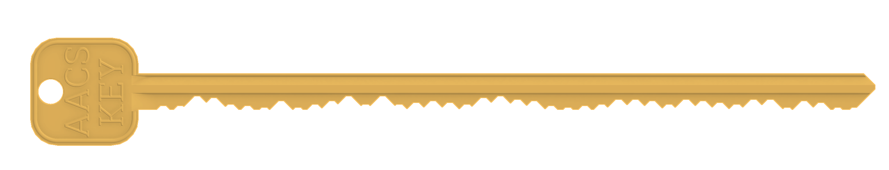

# illegal_key
Context: https://en.wikipedia.org/wiki/AACS_encryption_key_controversy

*Unlock* your media!

OpenSCAD file gently modified from from [Nirav Patel's](http://eclecti.cc/) [design](https://www.thingiverse.com/thing:8925/files) to support infinitely long bittings

Steps to generate key:
1. Run `python generate_bitting.py` and paste the result into `generate_key.scad`.
2. Use [OpenSCAD](https://openscad.org/) in order to run the code in `generate_key.scad` and then export the result as an STL file
3. Either print the STL file directly, or import it into a CAD tool and modify as necessary.
